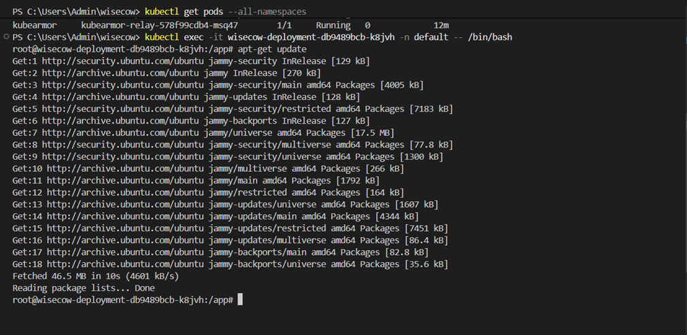

# 🐮 Wisecow App: Kubernetes Deployment, CI/CD, and Zero-Trust Security

Welcome to the **Wisecow Application Deployment & DevOps Automation** repository. This project showcases the containerization, orchestration, automation, monitoring, and zero-trust security implementation for the Wisecow application as part of the DevOps Trainee Practical Assessment.

---

## 🚀 Overview

This repository contains:
1. **Containerization**: A production-ready `Dockerfile` for the Wisecow Bash-based web application.
2. **Kubernetes Deployment**: Declarative manifests (`deployment.yaml`, `service.yaml`) for deploying the application inside a Kubernetes cluster (e.g., Minikube/Kind).
3. **CI/CD Pipeline**: A GitHub Actions workflow for building and pushing the Docker image to a registry.
4. **TLS Support**: Guidelines and configurations for securing the Wisecow application endpoints using TLS.
5. **System Health Monitor**: A Python script (`system_monitor.py`) leveraging `psutil` to monitor system performance metrics (CPU, memory, disk usage).
6. **Zero-Trust Security**: A KubeArmor security policy (`kubearmor-policy.yaml`) enforcing strict process execution and file access rules.

---

## 📁 Repository Structure

```directory
.
├── .github/
│   └── workflows/
│       └── cicd.yml              # CI/CD Pipeline Configuration (Git HEAD)
├── k8s/
│   ├── deployment.yaml           # Kubernetes Deployment Manifest
│   ├── service.yaml              # Kubernetes Service Manifest
│   └── kubearmor-policy.yaml     # Zero-Trust KubeArmor Security Policy
├── scripts/
│   ├── system_monitor.py         # Python System Health Monitoring Script
│   └── app_health_checker.py     # Python Application Uptime Health Checker
├── Dockerfile                    # Application Containerization Config
├── wisecow.sh                    # Wisecow Bash Shell Application
├── kubearmor-violation.png       # Policy Violation Screenshot
└── README.md                     # Project Documentation
```

---

## 🛠️ Problem Statement 1: Containerization, Deployment & TLS

### 🐳 1. Dockerization
The Wisecow app is containerized using an `ubuntu:22.04` base image to support Unix utilities like `fortune`, `cowsay`, and `netcat-openbsd`.

**Dockerfile Key Details:**
- Updates package indexes and installs dependencies safely.
- Appends `/usr/games` to the system `PATH` so `cowsay` and `fortune` execute seamlessly.
- Exposes port `4499` (used by `wisecow.sh` as its listener port).
- Runs `wisecow.sh` as the container entrypoint.

*To build and run locally:*
```bash
docker build -t wisecow-app:latest .
docker run -p 4499:4499 wisecow-app:latest
```

---

### ☸️ 2. Kubernetes Deployment
The application is deployed to Kubernetes via declarative YAML manifests located in the `/k8s` directory:

1. **Deployment (`k8s/deployment.yaml`)**:
   - Spawns `2 replicas` of the wisecow container for high availability.
   - Restarts pods automatically on failure.
   - Exposes container port `4499`.
2. **Service (`k8s/service.yaml`)**:
   - Exposes the deployment as a `ClusterIP` targeting port `4499` inside the container.
   - Exposes port `80` to cluster clients.

*To apply to your cluster:*
```bash
kubectl apply -f k8s/deployment.yaml
kubectl apply -f k8s/service.yaml
```

---

### 🔄 3. CI/CD Pipeline (`.github/workflows/cicd.yml`)
An automated build and push pipeline is configured via GitHub Actions.
- **Triggers**: Executed on every `push` to the `main` branch.
- **Workflow Steps**:
  1. Checks out the code.
  2. Authenticates to Docker Hub using repository secrets (`DOCKERHUB_USERNAME`, `DOCKERHUB_TOKEN`).
  3. Builds and tags the Docker image as `latest`.
  4. Pushes the image to the specified Docker Hub repository.
  5. Performs verification testing on Kubernetes manifests.

---

### 🔒 4. TLS Implementation (Challenge Goal)
To secure transit traffic to the Wisecow application with TLS, we can deploy an **Ingress Controller** (e.g., NGINX Ingress Controller) along with **cert-manager** to provision SSL certificates.

#### Steps to Configure TLS:
1. **Deploy Ingress Controller**:
   ```bash
   kubectl apply -f https://raw.githubusercontent.com/kubernetes/ingress-nginx/main/deploy/static/provider/cloud/deploy.yaml
   ```
2. **Create a TLS Secret** (or configure cert-manager for automated Let's Encrypt certificates):
   ```bash
   kubectl create secret tls wisecow-tls-secret --cert=path/to/tls.crt --key=path/to/tls.key
   ```
3. **Deploy Ingress Manifest**:
   ```yaml
   apiVersion: networking.k8s.io/v1
   kind: Ingress
   metadata:
     name: wisecow-ingress
     annotations:
       nginx.ingress.kubernetes.io/ssl-redirect: "true"
   spec:
     tls:
     - hosts:
       - wisecow.local
       secretName: wisecow-tls-secret
     rules:
     - host: wisecow.local
       http:
         paths:
         - path: /
           pathType: Prefix
           backend:
             service:
               name: wisecow-service
               port:
                 number: 80
   ```

---

## 📈 Problem Statement 2: System Health Monitoring & Application Health Checking

We have implemented two automation scripts using Python:

### 1. System Health Monitoring Script (`scripts/system_monitor.py`)
This script tracks hardware performance metrics on the server and generates alerts when configured thresholds are exceeded.

#### Key Capabilities:
- **CPU Monitoring**: Triggers an alert if CPU load exceeds 80%.
- **Memory Monitoring**: Triggers an alert if RAM utilization exceeds 80%.
- **Disk Usage Monitoring**: Triggers an alert if disk consumption exceeds 80%.
- **Process Count Monitoring**: Tracks the total number of running processes and alerts if the count exceeds 500.
- **Log Integration**: Appends warning logs containing timestamps to `system_health.log` and prints live alerts to the console.

#### Execution:
1. Ensure `psutil` is installed:
   ```bash
   pip install psutil
   ```
2. Run the script:
   ```bash
   python scripts/system_monitor.py
   ```
3. Read the logged alerts:
   ```bash
   cat system_health.log
   ```

---

### 2. Application Health Checker (`scripts/app_health_checker.py`)
This script performs automated status checks on a web application (e.g. Wisecow) using HTTP status codes to check whether the application is functioning correctly.

#### Key Capabilities:
- **HTTP Status Check**: Evaluates success based on standard HTTP status codes (2xx codes indicate **UP**; other codes indicate **DOWN**).
- **Graceful Error Handling**: Detects and logs specific failures, distinguishing between HTTP errors (like 404, 500) and connection/reachability errors (like connection refused or DNS failure).
- **Command-Line Arguments**: Accepts custom URL endpoints dynamically (falls back to `http://localhost:4499` if none is provided).

#### Execution:
1. Run the script (without parameters to check Wisecow locally):
   ```bash
   python scripts/app_health_checker.py
   ```
2. Run the script against a custom URL (e.g., Google or a production service):
   ```bash
   python scripts/app_health_checker.py https://www.google.com
   ```

---

## 🛡️ Problem Statement 3: Zero-Trust Security with KubeArmor

A Zero-Trust security model is implemented for the Kubernetes workload using a **KubeArmor Policy** (`k8s/kubearmor-policy.yaml`).

### Policy Rules Enforced:
- **Process Blocking**: Blocks execution of any binaries or processes in directory locations `/bin/` and `/usr/bin/` (recursive: true) unless explicitly whitelisted, preventing remote code execution (RCE) or shell injection.
- **File System Auditing**: Watches and audits all read/write/edit operations on `/etc/` configurations, logging any access attempts.

### Applying the Policy:
1. Ensure KubeArmor is installed in the cluster (e.g., via the Helm operator):
   ```bash
   helm repo add kubearmor https://kubearmor.github.io/charts
   helm repo update
   helm upgrade --install kubearmor-operator kubearmor/kubearmor-operator -n kubearmor --create-namespace
   ```
2. Apply the policy:
   ```bash
   kubectl apply -f k8s/kubearmor-policy.yaml
   ```

### Verification & Policy Violation Evidence
When an unauthorized process attempts to execute or an audit rule is triggered, KubeArmor blocks the execution and reports a violation.

The violation has been tested and logged. The screenshot capturing the KubeArmor violation is embedded below:



---

## 🚀 Execution & Deployment Guide

Follow these steps to deploy and run the entire ecosystem locally:

### 1. Run the Wisecow application locally
Ensure `cowsay` and `fortune` are installed locally, then run:
```bash
chmod +x wisecow.sh
./wisecow.sh
```
The app will be accessible at `http://localhost:4499`.

### 2. Run the Monitoring Script
```bash
python scripts/system_monitor.py
```

### 3. Deploy to Kubernetes (Minikube / Kind)
```bash
# Start your local cluster
minikube start

# Build the docker image and load it into minikube
docker build -t wisecow-app:latest .
minikube image load wisecow-app:latest

# Deploy resources
kubectl apply -f k8s/deployment.yaml
kubectl apply -f k8s/service.yaml

# Check pods status
kubectl get pods
```

---

## 👥 Authors & License
- Project Forked from: [nyrahul/wisecow](https://github.com/nyrahul/wisecow)
- Assessment completed by: DevOps Trainee
- License: MIT License
